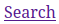
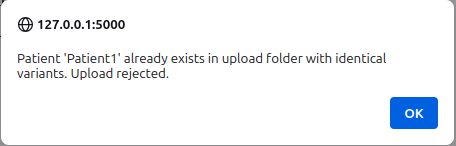
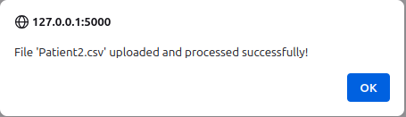
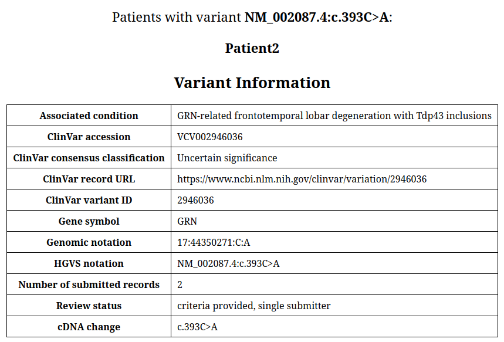
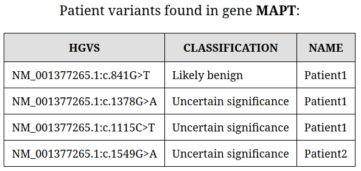
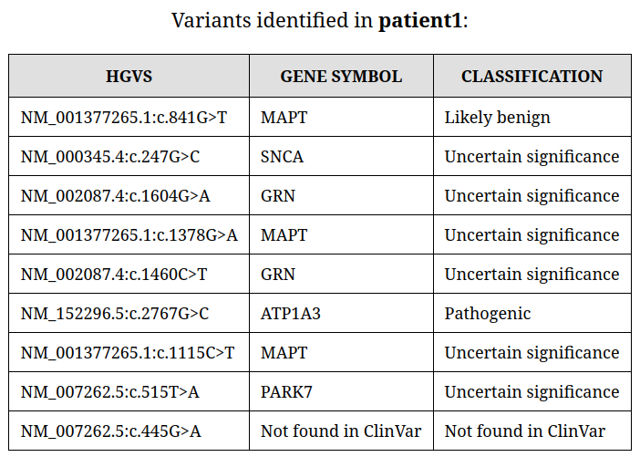
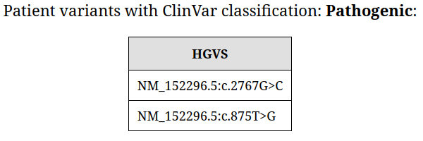
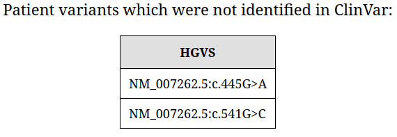

# User Manual
To install, start, and close the Parkinson's Annotator program, please refer to the
[installation manual](INSTALLATION.md).
## Starting Up
When the Parkinson's Annotator program starts, it will open to the **Search Page**.
If it doesn't, there is a **Search** button in the top left-hand corner
 
which directs to the **Search Page**.

## Uploading    Data
In the top right-hand corner of the Search page, there is a **Choose file** button
to select variant files. Both VCF and CSV file formats are accepted, with the file
name representing the **Patient Name**. Multiple files can be chosen at once by
selecting multiple files in the browse section.
After choosing your patient files, click the **Upload** button. This will then grey
out to prevent repeated pressing, and text next to the button will indicate it is
'Loading'. This loading process will take several seconds, as the programme connects
to trusted online databases (VariantValidator and ClinVar) via APIs to retrieve
necessary variant information, which is then stored by the application in the
database. Whilst this process makes uploading data slow, search functions in the
application will be quicker.

The upload function has built in checks, to ensure that if the same patient
data is uploaded twice, then the data won't be duplicated. If this happens a
pop-up will appear explaining this:

If the patient data being uploaded is no in the database, then once it has
been uploaded a pop-up will appear explaining this:

## Searching the Dataset
To use the **Search** function, a category must be selected from the
**Select category** drop-down menu. This tells the function where it should search
and what information should be returned. The search categories are: Variant,
Gene Symbol, Patient Name, and Classification. A brief overview of what inputs and
outputs are associated with each search category is given below the search bar on
the search page.

If Variant, Gene Symbol or Patient Name searches are selected, type or paste the
input into the search box, then click **Search** or press **Enter** on your keyboard.

If Classification search is selected, the search bar will be replaced with a second
drop-down menu, which contains the following options: Pathogenic, Likely
Pathogenic, Benign, Likely Benign, Uncertain Significance, Conflicting, Not
Provided, Not Found in Clinvar.

## Details of each search category
### Variant
**Input:** VCF-style genomic format (e.g. 17:44349216:A:G) or HGVS transcript notation (e.g.
NM_000345.4:c.247G>C).
The input is NOT case-sensitive, but does have to be exactly correct in terms of
values, otherwise the search will return 'No matching records found'.

**Output:** The first statement in the output reiterates the search made (e.g.
'Patients with variant [variant searched]:'). 
Below this there will be a list of all the patients in the
dataset with that variant. 
Below that there will be the header, 'Variant Information',
followed by a table showing all the associated ClinVar information (stored within the
database):
+ Associated condition
+ ClinVar accession - stable accession number for the ClinVar record
+ ClinVar consensus classification - clinical significance assigned to the variant (e.g. pathogenic, benign)
+ ClinVar record URL - to access variant record on ClinVar website
+ ClinVar variant ID - unique identifier assigned to the variant by ClinVar
+ Gene Symbol - symbol (NOT name) of the gene the variant is found in
+ VCF-style genomic format - adapted from the uploaded patient file
+ HGVS transcript notation
+ Number of submitted records - number of individual submissions supporting the ClinVar record
+ Review status - level of review or consensus for the ClinVar classification 
+ cDNA change - nucleotide change described in cDNA (HGVS) notation for the variant

Example: 

### Gene Symbol
**Input:** Gene symbol. Note that searching the gene name or other variant notation
format will not yield any results. The search is NOT case-sensitive.

**Output:** The first statement in the output reiterates the search made (e.g.
'Patient variants found in gene [gene searched]:'). 
Below this there will be a table that summarises: 
+ Patients with variants in that gene
+ The specific variant in that gene for each patient, in HGVS notation
+ Classification of the variant

Example: 

### Patient Name
**Input:** Patient Name (as it is in the uploaded variant file). To see
all patients in the dataset type 'patient' into the search bar. The
search is NOT case-sensitive.

**Output:** The first statement in the output reiterates the search made (e.g.
'Variants identified in [patient name search]:'). 
Below this will be a table summarising:
+ All variants for that patient (in HGVS format)
+ The associated gene symbol for each variant
+ The classification of each variant

If the search is for all patients, the first statement in the output will be
'Variants found in all patients', with all variants in the database summarised in
a table.

Example: 

### Classification
**Input:** Select a classification from the list in the drop-down menu.

**Output:** The first statement in the output will reiterate the search made (e.g.
'Patient variants with ClinVar classification: [classification search]:'). If the
classification selected is 'Not Found in Clinvar', the first statement in the output will
read, 'Patient variants which were not identified in ClinVar:'. Below this will be a
single-column table showing all variants in the database with that specific classification
(in HGVS format).

Examples: 

## Troubleshooting
The most likely issue to occur is a search returning nothing, when it is
expected to return results. If necessary, it is possible to directly view the
folder where the uploaded files are stored:

- If the program is run using docker, then the uploaded files are stored in: 
`./src/instance/uploads/`
- 
- If the program is run without using docker, then the files are stored in : 
`./src/parkinsons_annotator/instance/uploads`

The instance folder is created by the program, so does not exist
before the program is run for the first time. This is so that the database and
interactive elements are created locally to allow for secure data storage and
consistent interaction. So if the instance folder doesn't exist, run the
program to create these folders.

To ensure you are using the correct search input, you can copy data directly from one search
result and paste it into another search bar. For example, if you know a variant exists for
**patient1** but searching for that variant in the **'variant search'** returns no results,
try searching for patient1 using the **patient search**. Then, copy the variant information
from the patient’s results and paste it into the variant search bar. This helps ensure your
search input matches exactly what is stored in the database, leading to accurate results.